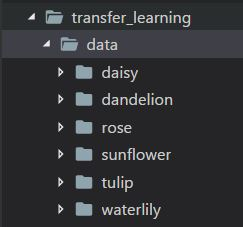

# Transfer Learning with TF and TF-HUB

**Table of Contents**

- [Running locally](#running-locally)
- [Running in the CLOUD](#running-in-the-cloud)
- [Model output](#model-output)

## Running locally

You can run it on your local machine with those untested steps:

1.  pip3 install -r floyd_requirements.txt
2.  to train locally put in 'data' folder the Training images like this

    

3.  python retrain.py --image_dir ./data/

## Running in the CLOUD

### the Fastest FREE Machine Learning Cloud ever

A better option is to run it in the "cloud" with Floydhub, it let's you train the network much faster using up to 20 free hours of training time.

### WARNING with this method works using one custom dataset uploaded to flodyhub here:

[**training image dataset**](https://www.floydhub.com/riccardogiorato/datasets/pocketbotanist-training)

Their VM are hosted in AWS and can be easily launched with a simple CLI.

1.  register [here](https://www.floydhub.com/signup)
2.  install the CLI
    1.  Pyhton2: `pip install -U floyd-cli`
    2.  Pyhton3: `pip3 install -U floyd-cli`
3.  login on it with `floyd login --token TOKEN_HERE` copied from [here](https://www.floydhub.com/settings/security)
4.  initialize the current folder with your personal flodyd project with `floyd init`
5.  then run it with flody run command:
    1.  transfer learning with InceptionV3: `floyd run --data riccardogiorato/datasets/pocketbotanist-training:/data --cpu --env tensorflow 'python retrain.py --image_dir /data/'`
    2.  transfer learning with MobilenetV2: `floyd run --data riccardogiorato/datasets/pocketbotanist-training:/data --cpu --env tensorflow 'python retrain.py --image_dir /data/ --architecture mobilenet_1.0_224 --tfhub_module https://tfhub.dev/google/imagenet/mobilenet_v2_100_224/feature_vector/1'`
6.  wait for your job on flodyhub to complete

## Model output

Finally to procede with the serving of your model:

- get the output
  - locally go to the new directory output in this current directory
  - on flodyhub go to the output tab and download the resulting model output directory
- pick those files:
  1.  output_graph.pb
  2.  output_labels.txt

Those two files are used to run your Tensorflow model anywhere you want!

You can use it on Algorithmia.com or port them to js.tensorflow.org following [this guide](../python/README.md)!
